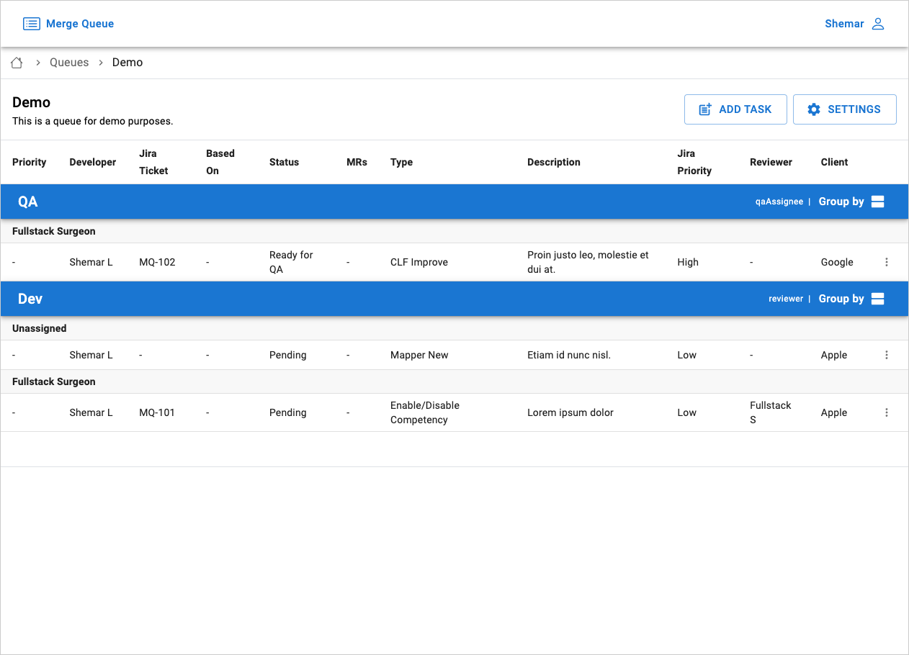

# Merge Queue
A queue management app for organizing the order in which MRs are merged.

While working with Clinc Inc., I developed an application to streamline development and project management processes in the context of the MR merge cycle.

### Features:
- Manage a queue of MRs to be merged
- Easily update status and stages with autocomplete fields
- Dynamic task grouping based on key fields
- Get notified when a merge task has changed or may require action

_This was a weekend project that was presented to the team and adopted as an in internal tool._

## Demo

https://merge-queue.shemarlindie.com

[Screenshots](./screenshots)

## Technologies
- **[React](https://reactjs.org):** Frontend / UI
- **[Firebase Firestore](https://firebase.google.com/docs/firestore):** Database
- **[Firebase Cloud Functions](https://firebase.google.com/docs/functions):** Database triggers and notification dispatch
- **[Sendgrid](https://sendgrid.com):** Email notifications
- **[TypeScript](https://www.typescriptlang.org):** Programming language used to write UI logic and cloud functions

## Testing

Automated test development is in progress on the [sl/functions_tests](https://github.com/shemarlindie/merge-queue/compare/sl/functions_tests) branch.

## Project Setup

### Requirements
- [Node.js](https://nodejs.org/)
- [Firebase CLI](https://firebase.google.com/docs/cli)
- [Java Runtime Environment](https://www.oracle.com/java/technologies/downloads/) (required to run [Firebase Emulators](https://firebase.google.com/docs/emulator-suite))

### Project Structure

The main project structure was created by [Create React App](https://create-react-app.dev) with a few additions for Firebase.

#### React
- `./src`: React frontend code
- `package.json`: dependencies for frontend
- `.env.example`: example ENV config for frontend
- `.env.local`: local ENV config for frontend (created per developer / not committed)

#### Firebase
- `.firebaserc.example`: example Firebase project config for the CLI
- `.firebaserc`: local Firebase project config for the CLI (created per developer / not committed)
- `firebase.json`: various configs for firebase modules
- `firestore.indexes.json`: config for [Firestore indexing](https://firebase.google.com/docs/firestore/query-data/indexing)
- `firestore.rules`: config for [Firestore rules](https://firebase.google.com/docs/firestore/security/get-started)
- `./functions`: Functions backend code

### Firebase Config

1. Create Firebase project ([pay-as-you-go](https://firebase.google.com/pricing) plan)
2. Enable the following services (visit each tab and click "Enable" if necessary):
   - Authentication (Google sign-in provider)
   - Firestore Database
   - Functions
   - Hosting
3. Create a web app config in project settings (needed for the next step). It should include:
   - Project ID
   - API Key
   - Other credentials / config

### Project Config
1. Create `.firebaserc` from `.firebaserc.example` and add project ID:
   - Lets the Firebase CLI interact with your project
2. Create `.env.local` from `.env.example` and add web app config
   - Used to configure Firebase in the React app 
3. Log in with the Firebase CLI: `firebase login`
4. Activate the `default` project (as configured in `.firebaserc`): `firebase use default`

### Sendgrid Config
1. Create Sendgrid account and configure [sender authentication](https://docs.sendgrid.com/ui/account-and-settings/how-to-set-up-domain-authentication)
2. Create [API key](https://docs.sendgrid.com/ui/account-and-settings/api-keys)
3. Configure Sendgrid variables in Firebase project:
   - API key: `firebase functions:config:set sendgrid.key=<key>`
   - "from" email address: `firebase functions:config:set sendgrid.from=<from email address>`
   - Enable notifications: `firebase functions:config:set app.notifications=true`

### Deployment
- Deploy to firebase: `firebase deploy`

### Run Locally
1. Install NPM packages (`npm install`) in the following directories:
   - `./`
   - `./functions`
2. Create function emulation config file (`./functions/.runtimeconfig.json`) from `./functions/.runtimeconfig.example.json`
3. Start emulators: `firebase emulators:start`
4. Start frontend: `npm start`

# Getting Started with Create React App

This project was bootstrapped with [Create React App](https://github.com/facebook/create-react-app).

## Available Scripts

In the project directory, you can run:

### `npm start`

Runs the app in the development mode.\
Open [http://localhost:3000](http://localhost:3000) to view it in the browser.

The page will reload if you make edits.\
You will also see any lint errors in the console.

### `npm test`

Launches the test runner in the interactive watch mode.\
See the section about [running tests](https://facebook.github.io/create-react-app/docs/running-tests) for more information.

### `npm run build`

Builds the app for production to the `build` folder.\
It correctly bundles React in production mode and optimizes the build for the best performance.

The build is minified and the filenames include the hashes.\
Your app is ready to be deployed!

See the section about [deployment](https://facebook.github.io/create-react-app/docs/deployment) for more information.

### `npm run eject`

**Note: this is a one-way operation. Once you `eject`, you can’t go back!**

If you aren’t satisfied with the build tool and configuration choices, you can `eject` at any time. This command will remove the single build dependency from your project.

Instead, it will copy all the configuration files and the transitive dependencies (webpack, Babel, ESLint, etc) right into your project so you have full control over them. All of the commands except `eject` will still work, but they will point to the copied scripts so you can tweak them. At this point you’re on your own.

You don’t have to ever use `eject`. The curated feature set is suitable for small and middle deployments, and you shouldn’t feel obligated to use this feature. However we understand that this tool wouldn’t be useful if you couldn’t customize it when you are ready for it.

## Learn More

You can learn more in the [Create React App documentation](https://facebook.github.io/create-react-app/docs/getting-started).

To learn React, check out the [React documentation](https://reactjs.org/).
